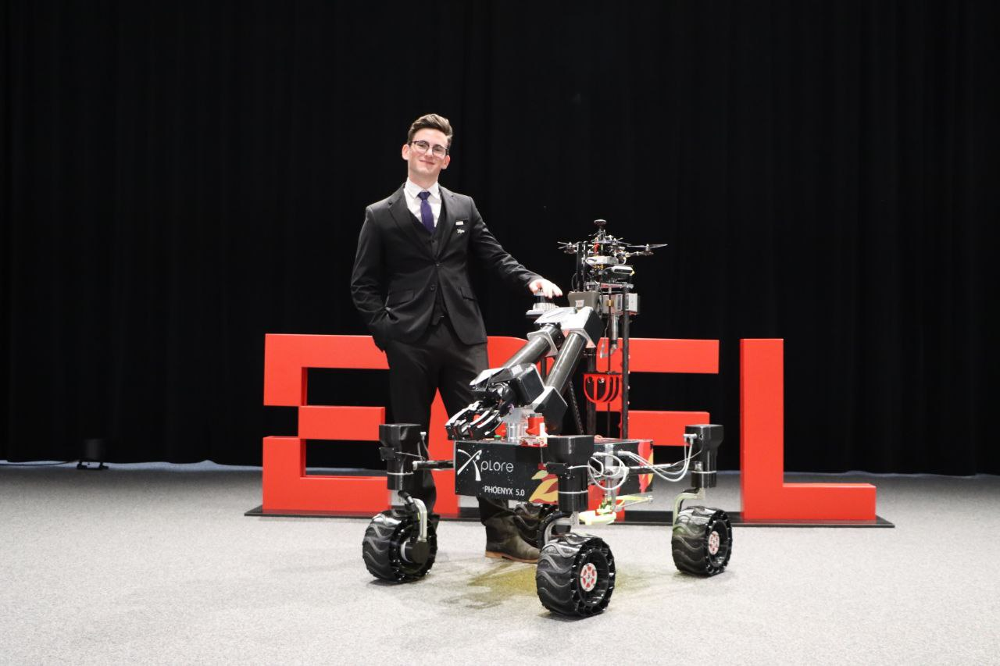
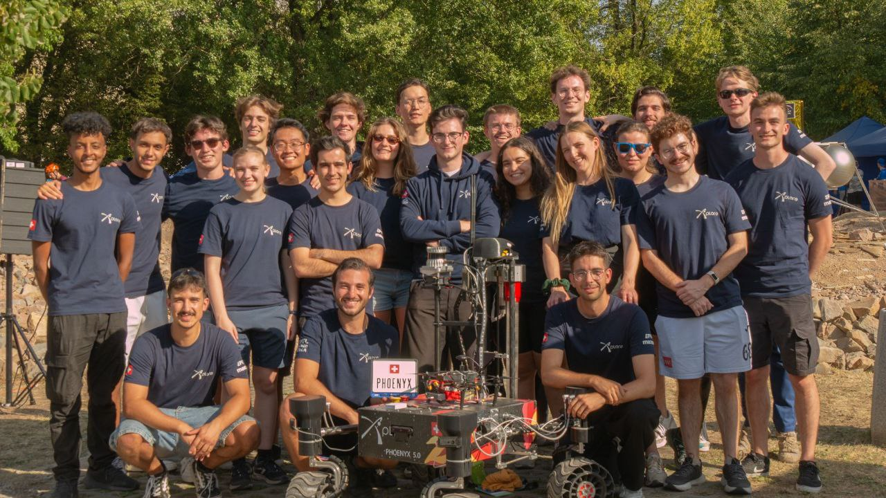
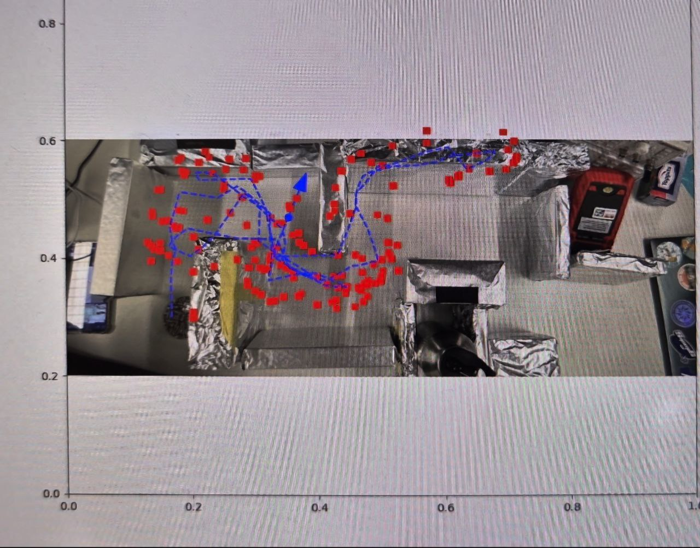
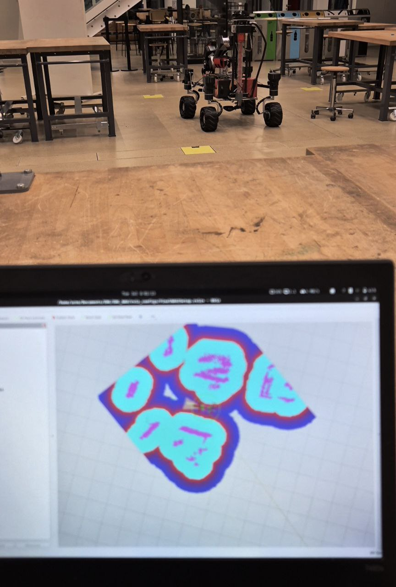
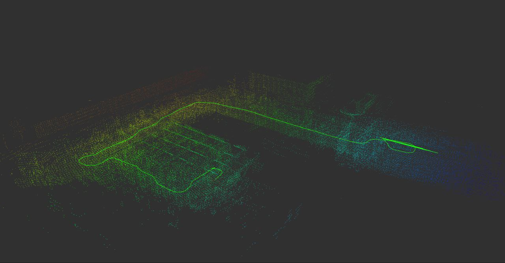
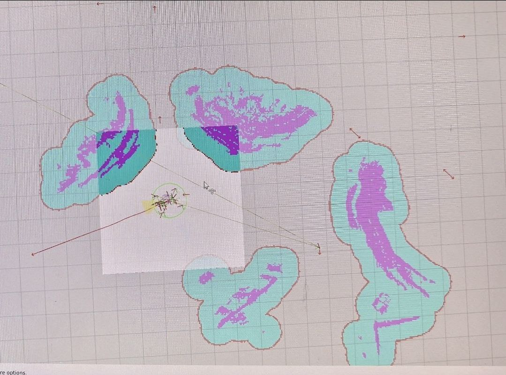

  

    <h1 style="margin: 0;">Arno Laurie</h1>
    <h2 style="margin-top: 0.5em; margin-bottom: 1em;">Robotics Engineer</h2>
    

      
      
      
    

  

  

    
  

---

## About Me

Robotics Master's student at **EPFL** with hands-on experience in autonomous navigation, robotic arm control, real-time systems using ROS2, and sensor fusion. Proven leadership in international competitions like the **European Rover Challenge**. Passionate about solving real-world problems through interdisciplinary robotics systems.

---

## Education

### **École Polytechnique Fédérale de Lausanne (EPFL)**
*Master of Science in Robotics* | 2025 - Ongoing

**Relevant Coursework:**
- Manipulation & Computer Vision
- Autonomous Navigation
- Sensor Fusion and State Estimation
- Machine Learning & Convex Optimization
- Multivariable and Non-Linear Control
- Model Predictive Control

### **École Polytechnique Fédérale de Lausanne (EPFL)**
*Bachelor of Science in Microengineering* | **5.38/6** | 2022 - 2025

**Relevant Coursework:**
- Electronics I & II, OOP, Digital System Design
- AVR Microcontrollers & Embedded Systems
- Control Systems & Actuators
- Real and Complex Analysis, Linear Algebra
- Signals and Systems, Semi-conductor Physics
- Introduction to PCB Design & Manufacturing

### **École Européenne Luxembourg II**
*Baccalauréat Scientifique* | **95.02/100** | 2022
- Secretary of the BAC Committee
- Yearbook Committee Member

---

## Featured Projects

### 🤖 **EPFL Xplore - European Rover Challenge Winner**
*Team Leader - Autonomous Navigation* | Sep 2024 - Aug 2025

**Overview:**
Led the development of the autonomous navigation subsystem for a Mars rover that won the European Rover Challenge 2025.

**Key Achievements:**
- Developed custom Extended Kalman Filter for sensor fusion
- Implemented double-Ackermann kinematics for precise control
- Applied triangulation, trilateration, and Computer Vision techniques
- Coordinated multidisciplinary teams for hardware-software integration

**Technologies:**
`C++` `Python` `ROS2` `OpenCV` `Docker` `Gazebo` `Arduino` `maxon EPOS`

[View Project Details →](#project-rover-winner)

---

### 🦾 **Custom 6DoF Robotic Arm**
*Personal Project* | Fall 2025 - Ongoing

<!--  -->

**Overview:**
Designing and building a fully 3D-printed 6-degree-of-freedom robotic arm with computer vision capabilities.

**Technical Highlights:**
- Motion planning using MoveIt framework
- Real-time control with ROS2
- Computer vision integration with OpenCV
- Custom mechanical design in Fusion 360

**Technologies:**
`ROS2` `MoveIt` `OpenCV` `Fusion 360` `Python` `C++`

[View Project Details →](#project-robotic-arm)

---

### 🚗 **STM32 RTOS Autonomous Mobile Robot**
*Academic Project* | Spring 2025

**Overview:**
Real-time autonomous navigation system for the e-puck 2 robot platform using ChibiOS RTOS.

**Technical Highlights:**
- Extended Kalman Filter for localization
- Real-time obstacle detection and mapping
- Efficient RTOS task scheduling
- Sensor fusion with IMU and proximity sensors

**Technologies:**
`STM32` `ChibiOS` `C` `EKF` `Embedded Systems`

[View Project Details →](#project-epuck)

---

### ☀️ **Solar Tracking Solar Oven**
*Personal Project* | Fall 2025 - Ongoing

<!--  -->

**Overview:**
Autonomous sun-tracking system for a solar oven, maximizing thermal efficiency through precise dual-axis control.

**Technical Highlights:**
- Custom DC-DC Buck converter PCB design
- ESP32-based control with FreeRTOS
- PID motor control for accurate sun tracking
- Lux sensor array for sun position detection

**Technologies:**
`ESP32` `FreeRTOS` `KiCad` `Fusion 360` `PID Control`

[View Project Details →](#project-solar-oven)

---

## Professional Experience

### **EPFL Xplore - Software Systems Engineer**
*Sep 2025 - Ongoing*

Leading the end-to-end software architecture of a 4-wheeled Martian rover:
- Autonomous navigation stack (ROS2/Nav2)
- Robotic arm control (MoveIt)
- Real-time wireless communication protocols
- Sensor fusion (IMU, LiDAR, cameras)
- Containerized deployments with Docker
- Team coordination across perception, planning, and control modules

### **EPFL Xplore - Software Engineer**
*Sep 2023 - Sep 2024*

Developed ROS2-based manual and autonomous navigation system:
- Implemented SLAM using 2D LiDAR
- Designed low-level PID motor controller with Arduino
- Custom wheel odometry implementation
- Cross-functional collaboration with mechanical and electrical teams

### **ETML - Machining Intern**
*Aug 2024*

Gained hands-on manufacturing experience in manual metal machining (turning, milling, drilling, sawing, tapping, brazing)

### **EPFL Teaching Assistant**
- EE-295 : Electrical Systems and Electronics 1
- EE-296 : Electrical Systems and Electronics 2
- ME-326 : Control Systems and discrete-time control

---

## Technical Skills

### **Programming Languages**

  

    C++
    Advanced
  

  

    

  

  

    Python
    Advanced
  

  

    

  

  

    MATLAB
    Intermediate
  

  

    

  

### **Robotics Frameworks**

  

    ROS2
    Advanced
  

  

    

  

  

    Nav2
    Intermediate
  

  

    

  

  

    OpenCV
    Intermediate
  

  

    

  

  

    Gazebo
    Intermediate
  

  

    

  

### **Control & Estimation**

  

    SLAM
    Advanced
  

  

    

  

  

    Extended Kalman Filter
    Advanced
  

  

    

  

  

    PID Control
    Advanced
  

  

    

  

  

    Model Predictive Control
    Intermediate
  

  

    

  

### **Embedded Systems**

  

    Arduino
    Advanced
  

  

    

  

  

    STM32
    Intermediate
  

  

    

  

  

    ESP32
    Intermediate
  

  

    

  

  

    FreeRTOS / ChibiOS
    Intermediate
  

  

    

  

### **Electronics & Hardware**

  

    KiCad (PCB Design)
    Intermediate
  

  

    

  

  

    Motor Control
    Advanced
  

  

    

  

### **Tools & Platforms**

  

    Docker
    Intermediate
  

  

    

  

  

    Linux / Git
    Advanced
  

  

    

  

  

    Simulink
    Intermediate
  

  

    

  

  

    Fusion 360
    Intermediate
  

  

    

  

---

## Competitions & Awards

### 🏆 **European Rover Challenge 2025 - Winner**
Led autonomous navigation team, which helped our team earn the 1st place in the international Mars rover competition ERC.

### 🥈 **Luxembourg Informatics Olympiad - Semi-Finalist**
Applied optimization and path-finding algorithms in competitive programming

---

## Languages

- 🇫🇷 **French** - Native
- 🇬🇧 **English** - Fluent (TOEFL iBT: 112/120)
- 🇩🇪 **German** - Basic
- 🇳🇱 **Dutch** - Basic

---

## Interests & Hobbies

🧗 Rock Climbing | 🏂 Snowboarding | 🎸 Electric Guitar | ⛵ Sailing

---

## Detailed Project Showcases

### **European Rover Challenge Winner - Autonomous Navigation System**

#### **Problem Statement**
Design and implement a robust autonomous navigation system for a Mars rover capable of operating in challenging outdoor environments with minimal human intervention.

#### **Solution Architecture**

**1. Localization & State Estimation**
- Custom Extended Kalman Filter fusing:
  - IMU data (orientation, angular velocity)
  - Wheel odometry (position, velocity)
  - LiDAR-Inertial Odometry
- Double-Ackermann kinematics model for accurate motion prediction

**2. Perception System**
- 3D Ouster LiDAR for obstacle detection and SLAM
- Camera-based landmark detection
- Triangulation and trilateration for landmark-base map localization

**3. Planning & Control**
- ROS2 Nav2 stack for path planning: Hybrid A*
- Dynamic obstacle avoidance
- Waypoint navigation with Pure Pursuit

**4. Communication & Integration**
- Wireless telemetry system for remote monitoring
- Docker containerization for consistent deployments on NVIDIA Jetson

#### **Results**
- 🥇 First place in European Rover Challenge 2025
- Successfully completed all autonomous navigation tasks
- Demonstrated robust performance in outdoor terrain
- Achieved sub 15cm accuracy in GPS-denied environments

#### **Technical Challenges & Solutions**

| Challenge | Solution |
|-----------|----------|
| Localization Precision | EKF Fusion with Wheel Odometry, 9-axis IMU, LiDAR-Inertial Odometry |
| Real-time performance | Optimized algorithms and leveraged GPU acceleration on Jetson |
| Sensor noise and drift | Custom EKF with adaptive noise covariance |

#### **Media Gallery**

  
  
  

---

### **6DoF Robotic Arm - Design & Control**

#### **Project Goals**
- Design a fully 3D-printable robotic arm
- Custom motor control library
- Implement inverse kinematics and motion planning
- Integrate computer vision for object manipulation
- Create a user-friendly control interface

#### **Mechanical Design**
- 6 degrees of freedom
- Custom 3D-printed components in Fusion 360
- Standard stepper motor interfaces

#### **Current Progress**
- ✅ Custom Arduino Stepper Motor control libary
- ✅ Motor Control through ros2 node
- ⏳ Mechanical Design in progress
- ⏳ Object Pose estimation using classical CV methods and DepthAnything V3
- ⏳ MoveIt Config with UR5 URDF

---

### **Solar Tracking Solar Oven**

#### **System Overview**
Automated dual-axis sun tracking system for cooking, with a small web app.

#### **Hardware Components**
- **Microcontroller:** ESP32
- **Sensors:** 6x lux sensors in multiple directions
- **Actuators:** 2x stepper motors (pitch & yaw)
- **Power:** Custom PCB DC-DC buck converter (24V → 5V/3.3V)

---

### **STM32 RTOS Autonomous Mobile Robot**

#### **Platform**
e-puck 2 educational robot with:
- STM32F407 microcontroller
- 8 proximity sensors
- IMU (accelerometer, gyroscope)
- Differential drive system

#### **Real-Time Architecture**
Built on ChibiOS RTOS with prioritized tasks:
1. **High Priority:** Motor control
2. **Medium Priority:** Sensor reading
3. **Medium Priority:** EKF localization
4. **Low Priority:** Map creation using detected obstacles

---

### **Mechanial Oscillator design with mechanical flexures**
- insensitive to linear and angular velocities and accelerations
- Fusion 360 CAD and Simulations
- Material Selection

---

### **AVR Assembly Project**
- LCD, Keypad, Stepper Motor and distance sensor integration

## Contact

I'm always interested in discussing robotics projects, collaboration opportunities, or new challenges in autonomous systems.

📧 **Email:** [arno.laurie.pro@gmail.com](mailto:/arno.laurie.pro@gmail.com)

🔗 **LinkedIn:** [linkedin.com/in/arno-laurie](https://ch.linkedin.com/in/arno-laurie-816a73229)

💻 **GitHub:** [github.com/Netfluxx](https://github.com/Netfluxx)

📍 **Location:** Lausanne, Switzerland

---

*Last updated: November 2025*