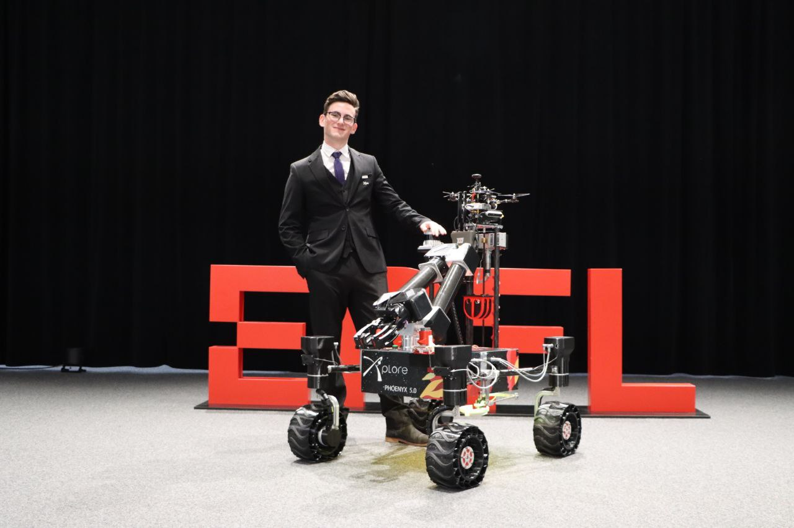
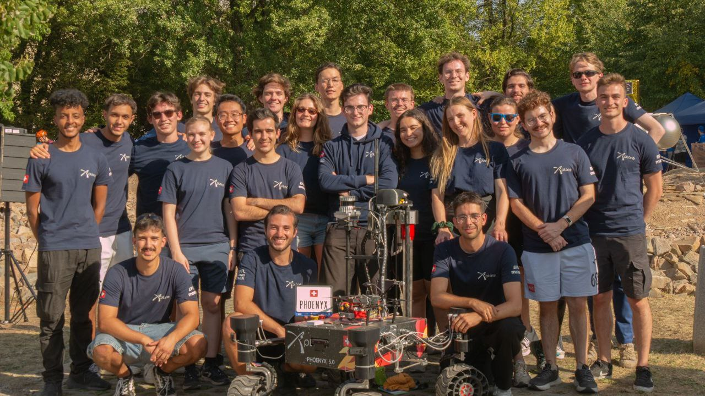
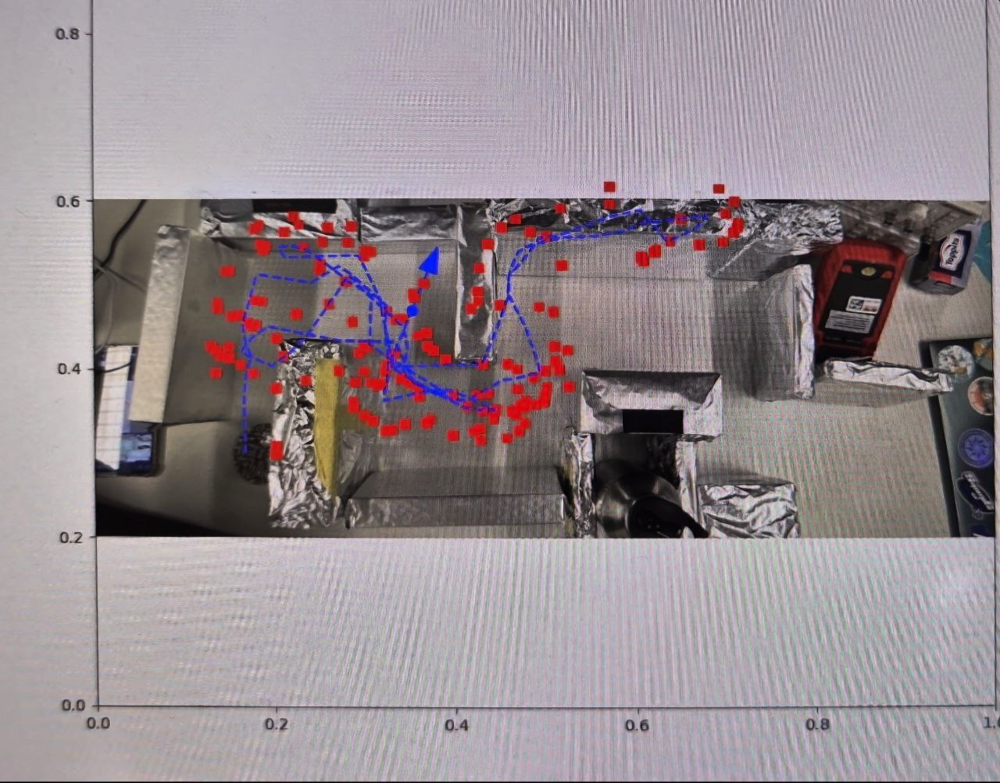
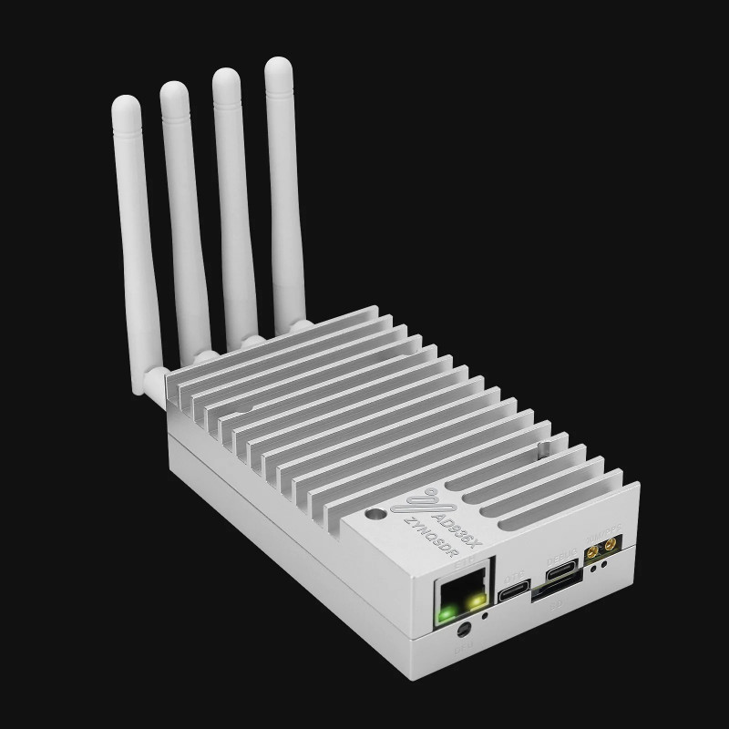
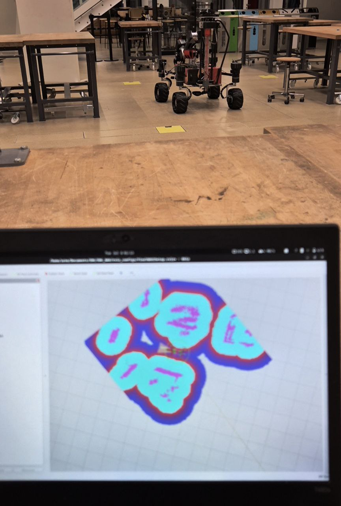
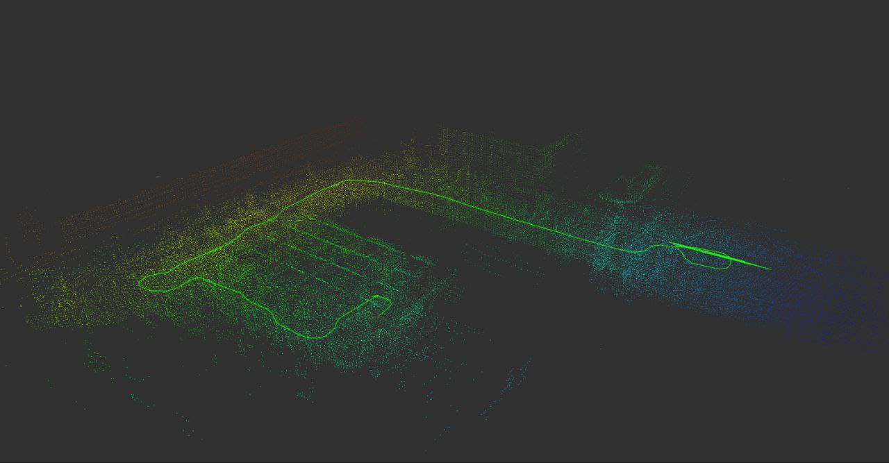
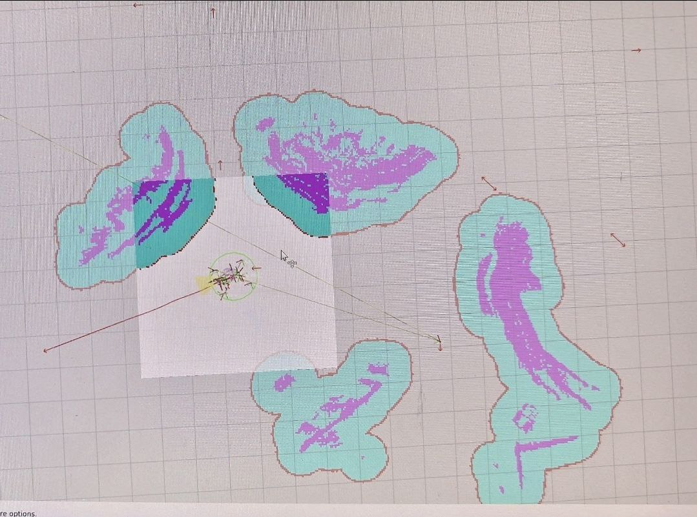
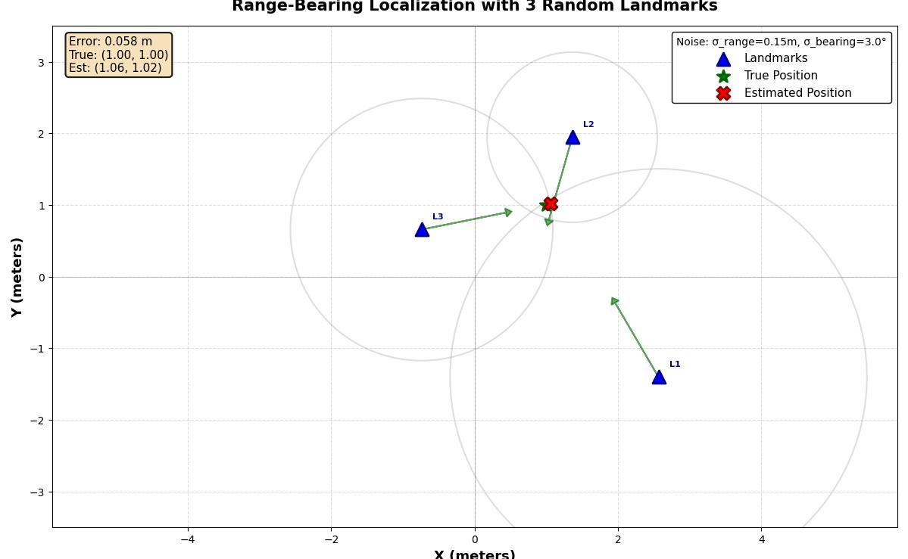

  

    <h1>Arno Laurie</h1>
    
Robotics Engineer

    

      <a href="mailto:arno.laurie.pro@gmail.com" class="hero__badge">
        <svg viewBox="0 0 24 24"><path d="M20 4H4c-1.1 0-2 .9-2 2v12c0 1.1.9 2 2 2h16c1.1 0 2-.9 2-2V6c0-1.1-.9-2-2-2zm0 4l-8 5-8-5V6l8 5 8-5v2z"/></svg>
        Email
      </a>
      <a href="https://ch.linkedin.com/in/arno-laurie-816a73229" class="hero__badge">
        <svg viewBox="0 0 24 24"><path d="M19 3a2 2 0 012 2v14a2 2 0 01-2 2H5a2 2 0 01-2-2V5a2 2 0 012-2h14m-.5 15.5v-5.3a3.26 3.26 0 00-3.26-3.26c-.85 0-1.84.52-2.32 1.3v-1.11h-2.79v8.37h2.79v-4.93c0-.77.62-1.4 1.39-1.4a1.4 1.4 0 011.4 1.4v4.93h2.79M6.88 8.56a1.68 1.68 0 001.68-1.68c0-.93-.75-1.69-1.68-1.69a1.69 1.69 0 00-1.69 1.69c0 .93.76 1.68 1.69 1.68m1.39 9.94v-8.37H5.5v8.37h2.77z"/></svg>
        LinkedIn
      </a>
      <a href="https://github.com/Netfluxx" class="hero__badge">
        <svg viewBox="0 0 24 24"><path d="M12 2A10 10 0 002 12c0 4.42 2.87 8.17 6.84 9.5.5.08.66-.23.66-.5v-1.69c-2.77.6-3.36-1.34-3.36-1.34-.46-1.16-1.11-1.47-1.11-1.47-.91-.62.07-.6.07-.6 1 .07 1.53 1.03 1.53 1.03.87 1.52 2.34 1.07 2.91.83.09-.65.35-1.09.63-1.34-2.22-.25-4.55-1.11-4.55-4.92 0-1.11.38-2 1.03-2.71-.1-.25-.45-1.29.1-2.64 0 0 .84-.27 2.75 1.02.79-.22 1.65-.33 2.5-.33.85 0 1.71.11 2.5.33 1.91-1.29 2.75-1.02 2.75-1.02.55 1.35.2 2.39.1 2.64.65.71 1.03 1.6 1.03 2.71 0 3.82-2.34 4.66-4.57 4.91.36.31.69.92.69 1.85V21c0 .27.16.59.67.5C19.14 20.16 22 16.42 22 12A10 10 0 0012 2z"/></svg>
        GitHub
      </a>
    

  

  

    
  

---

## About Me

Robotics Master's student at <strong>EPFL</strong> with hands-on experience in autonomous navigation, robotic arm control, real-time systems using ROS2, and sensor fusion. Proven leadership in international competitions like the <strong>European Rover Challenge</strong>. Passionate about solving real-world problems through interdisciplinary robotics systems.

---

## Education

### EPFL — Master of Science in Robotics
*2025 — Ongoing*

**Relevant Coursework:**
- Manipulation & Computer Vision
- Autonomous Navigation
- Sensor Fusion and State Estimation
- Machine Learning & Convex Optimization
- Multivariable and Non-Linear Control
- Model Predictive Control

### EPFL — Bachelor of Science in Microengineering
*GPA: **5.38 / 6** | 2022 — 2025*

**Relevant Coursework:**
- Electronics I & II, OOP, Digital System Design
- AVR Microcontrollers & Embedded Systems
- Control Systems & Actuators
- Real and Complex Analysis, Linear Algebra
- Signals and Systems, Semi-conductor Physics
- Introduction to PCB Design & Manufacturing

### École Européenne Luxembourg II
*Baccalauréat Scientifique | **95.02 / 100** | 2022*
- Secretary of the BAC Committee
- Yearbook Committee Member

---

## Projects

### EPFL Xplore — European Rover Challenge Winner
*Team Leader — Autonomous Navigation | Sep 2024 — Aug 2025*

**Overview:**
Led the development of the autonomous navigation subsystem for a Mars rover that won the European Rover Challenge 2025.

**Key Achievements:**
- Developed custom Extended Kalman Filter for sensor fusion
- Implemented double-Ackermann kinematics for precise control
- Use of the Nav2 Stack
- Applied triangulation, trilateration, and Computer Vision techniques
- Coordinated with multidisciplinary teams for hardware-software integration

**Technologies:**
`C++` `Python` `ROS2` `OpenCV` `Docker` `Gazebo` `Arduino` `maxon EPOS`

[View Project Details →](#project-rover-winner)

### Custom 6DoF Robotic Arm
*Personal Project | Fall 2025 — Ongoing*

**Overview:**
Designing and building a fully 3D-printed 6-degree-of-freedom robotic arm with computer vision capabilities.

**Technical Highlights:**
- Motion planning using MoveIt framework
- Real-time control with ROS2
- Computer vision integration with OpenCV
- Custom mechanical design in Fusion 360

**Technologies:**
`ROS2` `MoveIt` `OpenCV` `Fusion 360` `Python` `C++`

[View Project Details →](#project-robotic-arm)

### Thymio Autonomous Mobile Robot
*Academic Project | Fall 2025*

**Overview:**
Real-time autonomous navigation system for the Thymio educational robot.

**Technical Highlights:**
- Extended Kalman Filter for localization
- ArUco tag triangulation & trilateration using convex optimization
- Real-time obstacle detection
- Global Path Planning

**Technologies:**
`Python` `EKF` `OpenCV`

### STM32 RTOS Autonomous Mobile Robot
*Academic Project | Spring 2025*

<!--  -->

**Overview:**
Real-time autonomous navigation system for the e-puck 2 robot platform using ChibiOS RTOS.

**Technical Highlights:**
- Extended Kalman Filter for localization
- Real-time obstacle detection and mapping
- Efficient RTOS task scheduling
- Sensor fusion with IMU and proximity sensors

**Technologies:**
`STM32` `ChibiOS` `C` `EKF` `Embedded Systems`

### Direction of Arrival using LibreSDR
*Personal Project | Fall 2025*

**Overview:**
MUSIC and Root-MUSIC algorithm implementations on the LibreSDR.

**Technical Highlights:**
- Signal Processing

**Technologies:**
`DoA` `SDR`

### Solar Tracking Solar Oven
*Personal Project | Fall 2025 — Ongoing*

**Overview:**
Autonomous sun-tracking system for a solar oven, maximizing thermal efficiency through precise dual-axis control.

**Technical Highlights:**
- Custom DC-DC Buck converter PCB design
- ESP32-based control with FreeRTOS
- PID motor control for accurate sun tracking
- Lux sensor array for sun position detection

**Technologies:**
`ESP32` `FreeRTOS` `KiCad` `Fusion 360` `PID Control`

[View Project Details →](#project-solar-oven)

### Mechanical Oscillator Design
*Academic Project*

- Insensitive to linear and angular velocities and accelerations
- Fusion 360 CAD and Simulations
- Material Selection

### AVR Assembly Project
*Academic Project*

- AVR Assembly Code
- LCD, Keypad, Stepper Motor and distance sensor integration

---

## Technical Skills

### Programming Languages

  

    C++
    Advanced
  

  

    

  

  

    Python
    Advanced
  

  

    

  

  

    MATLAB
    Intermediate
  

  

    

  

### Robotics Frameworks

  

    ROS2
    Advanced
  

  

    

  

  

    Nav2
    Intermediate
  

  

    

  

  

    OpenCV
    Intermediate
  

  

    

  

  

    Gazebo
    Intermediate
  

  

    

  

### Control & Estimation

  

    Extended Kalman Filter
    Advanced
  

  

    

  

  

    PID Control
    Advanced
  

  

    

  

  

    Path Following
    Advanced
  

  

    

  

  

    Model Predictive Control
    Intermediate
  

  

    

  

### Embedded Systems

  

    Arduino
    Advanced
  

  

    

  

  

    STM32
    Intermediate
  

  

    

  

  

    ESP32
    Intermediate
  

  

    

  

  

    FreeRTOS / ChibiOS
    Intermediate
  

  

    

  

### Electronics & Hardware

  

    KiCad (PCB Design)
    Intermediate
  

  

    

  

  

    Motor Control
    Advanced
  

  

    

  

### Tools & Platforms

  

    Docker
    Intermediate
  

  

    

  

  

    Linux / Git
    Advanced
  

  

    

  

  

    Simulink
    Intermediate
  

  

    

  

  

    Fusion 360
    Intermediate
  

  

    

  

---

## Competitions & Awards

  
🏆

  

    <h3>European Rover Challenge 2025 — Winner</h3>
    
Led autonomous navigation team, which helped our team earn 1st place in the international Mars rover competition ERC.

  

  
🥈

  

    <h3>Luxembourg Informatics Olympiad — Semi-Finalist</h3>
    
Applied optimization and path-finding algorithms in competitive programming.

  

---

## Languages

  
🇫🇷 <strong>French</strong> Native

  
🇬🇧 <strong>English</strong> Fluent (TOEFL 112/120)

  
🇩🇪 <strong>German</strong> Basic

  
🇳🇱 <strong>Dutch</strong> Basic

---

## Interests & Hobbies

  🧗 Rock Climbing
  🏂 Snowboarding
  🎸 Electric Guitar
  ⛵ Sailing

---

## Detailed Project Showcases

### European Rover Challenge Winner — Autonomous Navigation System

#### Problem Statement
Design and implement a robust autonomous navigation system for a Mars rover capable of operating in challenging outdoor environments with minimal human intervention.

#### Solution Architecture

**1. Localization & State Estimation**
- Custom Extended Kalman Filter fusing:
  - IMU data (orientation, angular velocity)
  - Wheel odometry (position, velocity)
  - LiDAR-Inertial Odometry
- Double-Ackermann kinematics model for accurate motion prediction

**2. Perception System**
- 3D Ouster LiDAR for obstacle detection and SLAM
- Camera-based landmark detection
- Triangulation and trilateration for landmark-base map localization

**3. Planning & Control**
- ROS2 Nav2 stack for path planning: Hybrid A*
- Dynamic obstacle avoidance
- Waypoint navigation with Pure Pursuit

**4. Communication & Integration**
- Wireless telemetry system for remote monitoring
- Docker containerization for consistent deployments on NVIDIA Jetson

#### Results
- 🥇 First place in European Rover Challenge 2025
- Successfully completed all autonomous navigation tasks
- Demonstrated robust performance in outdoor terrain
- Achieved sub 15cm accuracy in GPS-denied environments

#### Technical Challenges & Solutions

| Challenge | Solution |
|-----------|----------|
| Localization Precision | EKF Fusion with Wheel Odometry, 9-axis IMU, LiDAR-Inertial Odometry & Global Pose Corrections using triangulation and trilateration |
| Real-time performance | Optimized algorithms and leveraged GPU acceleration on Jetson |
| Sensor noise and drift | Custom EKF with adaptive noise covariance |

Solved using CVXPY and the ECOS SOCP Solver

---

### 6DoF Robotic Arm — Design & Control

#### Project Goals
- Design a fully 3D-printable robotic arm
- Custom motor control library
- Implement inverse kinematics and motion planning
- Integrate computer vision for object manipulation
- Create a user-friendly control interface

#### Mechanical Design
- 6 degrees of freedom
- Custom 3D-printed components in Fusion 360
- Standard stepper motor interfaces

#### Current Progress
- ✅ Custom Arduino Stepper Motor control library
- ✅ Motor Control through ROS2 node
- ⏳ Mechanical Design in progress
- ⏳ Object Pose estimation using classical CV methods and DepthAnything V3
- ⏳ MoveIt Config with UR5 URDF

---

## Contact

I'm always interested in discussing robotics projects, collaboration opportunities, or new challenges in autonomous systems.

📧 **Email:** [arno.laurie.pro@gmail.com](mailto:arno.laurie.pro@gmail.com)

🔗 **LinkedIn:** [linkedin.com/in/arno-laurie](https://ch.linkedin.com/in/arno-laurie-816a73229)

💻 **GitHub:** [github.com/Netfluxx](https://github.com/Netfluxx)

📍 **Location:** Lausanne, Switzerland

---

*Last updated: November 2025*
