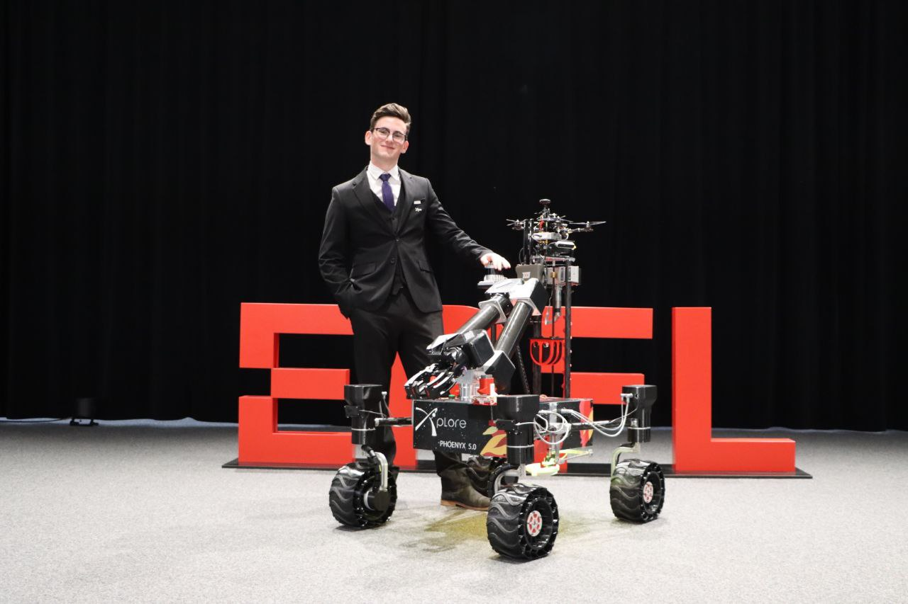
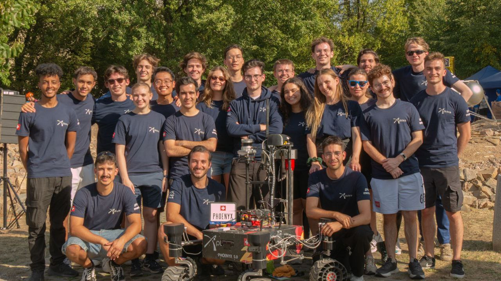
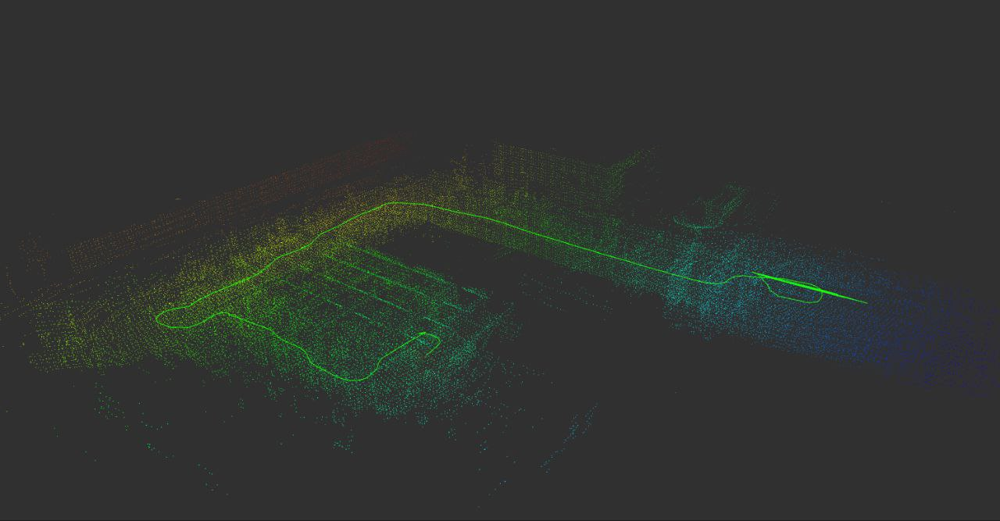
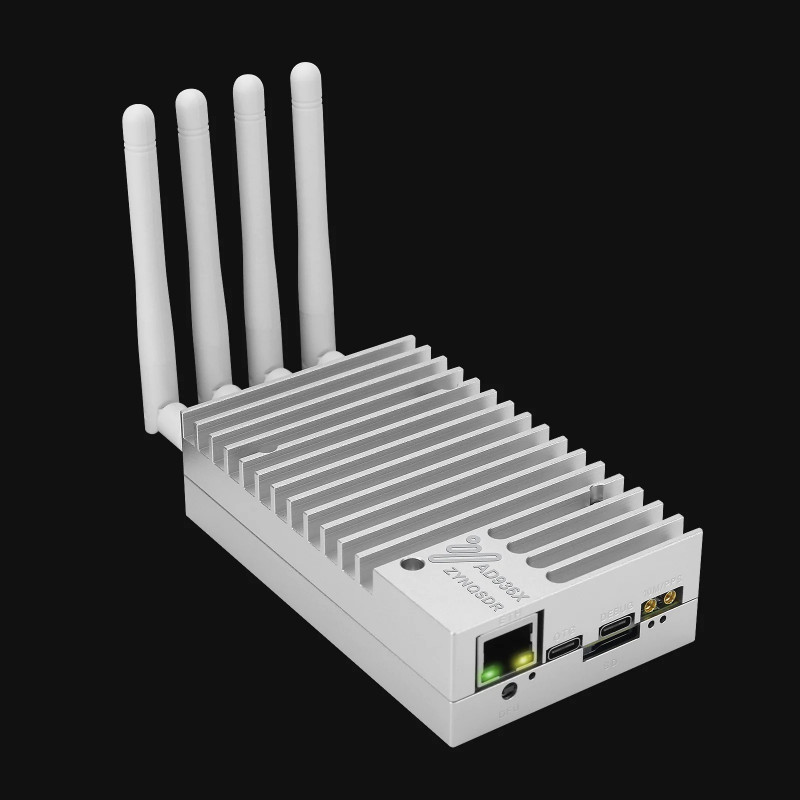
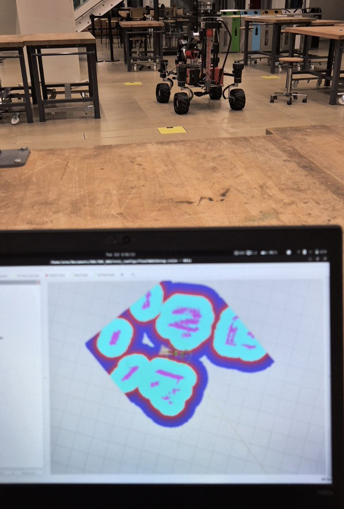
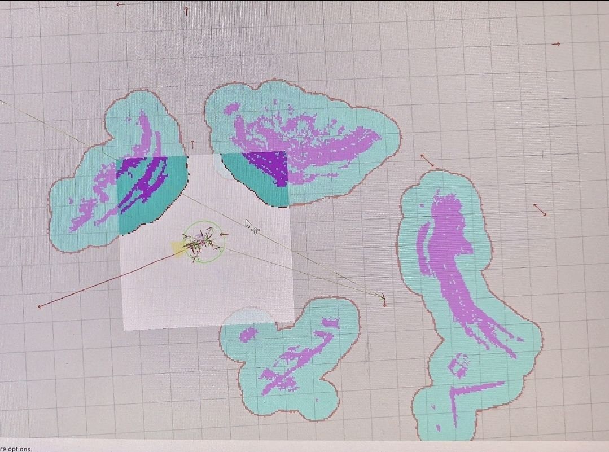
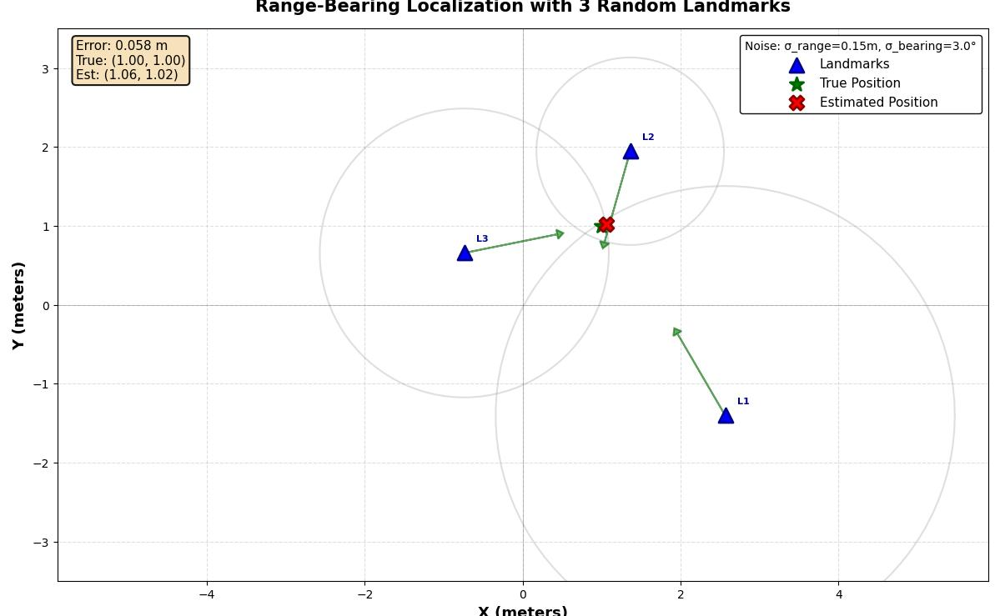

  

    <h1>Arno Laurie</h1>
    
State Estimation & Navigation

    
Robotics MSc·EPFL·ERC 2025 & 2026 Winner

    

      <a href="mailto:arno.laurie.pro@gmail.com" class="hero__badge">
        <svg viewBox="0 0 24 24"><path d="M20 4H4c-1.1 0-2 .9-2 2v12c0 1.1.9 2 2 2h16c1.1 0 2-.9 2-2V6c0-1.1-.9-2-2-2zm0 4l-8 5-8-5V6l8 5 8-5v2z"/></svg>
        Email
      </a>
      <a href="https://ch.linkedin.com/in/arno-laurie-816a73229" class="hero__badge">
        <svg viewBox="0 0 24 24"><path d="M19 3a2 2 0 012 2v14a2 2 0 01-2 2H5a2 2 0 01-2-2V5a2 2 0 012-2h14m-.5 15.5v-5.3a3.26 3.26 0 00-3.26-3.26c-.85 0-1.84.52-2.32 1.3v-1.11h-2.79v8.37h2.79v-4.93c0-.77.62-1.4 1.39-1.4a1.4 1.4 0 011.4 1.4v4.93h2.79M6.88 8.56a1.68 1.68 0 001.68-1.68c0-.93-.75-1.69-1.68-1.69a1.69 1.69 0 00-1.69 1.69c0 .93.76 1.68 1.69 1.68m1.39 9.94v-8.37H5.5v8.37h2.77z"/></svg>
        LinkedIn
      </a>
      <a href="https://github.com/Netfluxx" class="hero__badge">
        <svg viewBox="0 0 24 24"><path d="M12 2A10 10 0 002 12c0 4.42 2.87 8.17 6.84 9.5.5.08.66-.23.66-.5v-1.69c-2.77.6-3.36-1.34-3.36-1.34-.46-1.16-1.11-1.47-1.11-1.47-.91-.62.07-.6.07-.6 1 .07 1.53 1.03 1.53 1.03.87 1.52 2.34 1.07 2.91.83.09-.65.35-1.09.63-1.34-2.22-.25-4.55-1.11-4.55-4.92 0-1.11.38-2 1.03-2.71-.1-.25-.45-1.29.1-2.64 0 0 .84-.27 2.75 1.02.79-.22 1.65-.33 2.5-.33.85 0 1.71.11 2.5.33 1.91-1.29 2.75-1.02 2.75-1.02.55 1.35.2 2.39.1 2.64.65.71 1.03 1.6 1.03 2.71 0 3.82-2.34 4.66-4.57 4.91.36.31.69.92.69 1.85V21c0 .27.16.59.67.5C19.14 20.16 22 16.42 22 12A10 10 0 0012 2z"/></svg>
        GitHub
      </a>
    

  

  

    
  

---

## About Me

I am a Robotics MSc student at EPFL specializing in <strong>state estimation</strong>. I build real-time localization systems: factor-graph optimization, Kalman filtering, SLAM and multi-sensor fusion for GNSS-denied platforms.

As a <strong>Navigation Engineer at VLRX</strong>, I design a factor-graph localization solver for a Low Earth Orbit positioning, navigation and timing (PNT) system. It fuses satellite measurements with IMU, VIO, magnetometer and barometer data. Before that, I developed the AHRS firmware for a custom PCB at <strong>coprod SA</strong>.

At EPFL Xplore, I led the navigation subsystem of the rover that won the <strong>European Rover Challenge 2025</strong>. I then led the software of the rover that won <strong>ERC 2026</strong>, coordinating a team of 15 engineers. My experience ranges from embedded C++ firmware to full ROS&nbsp;2 navigation stacks.

---

## Projects

Featured — SLAM & State Estimation

&#9733; ERC 2025 Winner

### LiDAR-Inertial SLAM — Mars Rover Navigation Stack
*EPFL Xplore | Team Leader Autonomous Navigation | Sep 2024 — Aug 2025*

Led the **autonomous navigation subsystem** — localization, SLAM and path planning — of a 4-wheeled Mars rover competing in the European Rover Challenge 2025. GPS-denied outdoor terrain, no fallback.

**SLAM & Localization:**
- LiDAR-inertial SLAM pipeline (Ouster 3D LiDAR + 9-axis IMU)
- Custom Extended Kalman Filter with a double-Ackermann kinematic model, fusing wheel odometry, IMU, and LiDAR-inertial odometry
- Global pose corrections via triangulation, trilateration and computer vision, solved with convex optimization (CVXPY/ECOS)
- Sub-15 cm accuracy in GPS-denied outdoor environments
- Production SLAM systems tuned on hardware: **LIO-SAM**, **FAST-LIO2**, **GLIM**

**Planning & Control:**
- Nav2 stack with Hybrid A\* global planner
- Pure Pursuit path tracking with double-Ackermann kinematics
- Dynamic obstacle avoidance

**Technologies:**
`C++` `Python` `ROS2` `OpenCV` `Docker` `Gazebo` `Arduino` `maxon EPOS`

[View Detailed Showcase →](#project-rover-winner)

&#9733; ERC 2026 Winner

### EPFL Xplore — Software Lead of the ERC 2026 Rover
*EPFL Xplore | Software Systems Engineer | Sep 2025 — Ongoing*

Led the software of the rover that won the **European Rover Challenge 2026**, coordinating a team of **15 engineers**. Back-to-back win after ERC 2025.

**System architecture (end-to-end owner):**
- Autonomous navigation with ROS2 and Nav2
- Robotic arm control with MoveIt
- Wireless links with Mikrotik routers and software-defined radio
- Perception, planning and control integrated on NVIDIA Jetson, fusing IMU, LiDAR and RGB camera data
- Full software stack containerized with Docker for reproducible field deployment

**Technologies:**
`C++` `Python` `ROS2` `Nav2` `MoveIt` `OpenCV` `Docker` `maxon EPOS`

&#9733; SLAM

### Real-Time 3D SLAM with Gaussian Mixture Models
*Spring 2026*

A real-time 3D SLAM stack in C++ built on **GTSAM factor-graph optimization**, fusing LiDAR point clouds and IMU data. The map is a **Gaussian Mixture Model**, a compact representation of the environment.

**Architecture:**
- **Front-end:** point-cloud registration for incremental odometry; IMU preintegration for inter-frame constraints
- **Back-end:** GTSAM factor-graph optimization in real time
- **Place recognition:** loop closure detection and pose-graph correction
- **Map:** Gaussian Mixture Model map instead of a dense point cloud

**Technologies:**
`C++` `GTSAM` `PCL` `Eigen` `ROS2` `LiDAR` `IMU`

Other Projects

### Robust and Non-Linear MPC for Rocket Landing
*Academic Project | Fall 2025*

Designed and tuned robust and non-linear model predictive controllers for a 6-DOF rocket landing.

**Technologies:**
`Python` `CasADi` `MPC` `Optimization`

### STM32 RTOS Autonomous Mobile Robot
*Academic Project | Spring 2025*

Real-time autonomous navigation on the e-puck2 platform using ChibiOS RTOS. Extended Kalman Filter for localization, real-time obstacle detection and mapping, efficient RTOS task scheduling, sensor fusion with IMU and proximity sensors.

**Technologies:**
`STM32` `ChibiOS` `C` `EKF` `Embedded Systems`

### Thymio Autonomous Mobile Robot
*Academic Project | Fall 2025*

Autonomous navigation with EKF localization and ArUco tag triangulation & trilateration using **convex optimization** (CVXPY/ECOS). Global path planning and real-time obstacle detection.

**Technologies:**
`Python` `EKF` `OpenCV` `CVXPY`

### Solar Tracking Solar Oven
*Personal Project | Fall 2025 — Ongoing*

2-DoF sun-tracking system with custom DC-DC Buck converter PCB, ESP32 on FreeRTOS, lux sensor array, PID motor control, and mechanical design in Fusion 360.

**Technologies:**
`ESP32` `FreeRTOS` `KiCad` `Fusion 360` `PID`

### Angle-of-Arrival RF Localization — LibreSDR
*Personal Project | Fall 2025*

Angle-of-arrival radio direction finding with software-defined radio hardware. MUSIC and Root-MUSIC implementations on the LibreSDR platform.

**Technologies:**
`Python` `SDR` `Signal Processing`

---

## Technical Skills

### SLAM & Localization

  
LiDAR-Inertial SLAMAdvanced

  

  
GTSAM / Factor GraphsAdvanced

  

  
LIO-SAM · FAST-LIO2 · GLIMIntermediate

  

  
Visual-Inertial OdometryIntermediate

  

### State Estimation

  
Extended Kalman FilterAdvanced

  

  
Unscented Kalman FilterAdvanced

  

  
IMU / LiDAR / Camera FusionAdvanced

  

  
AHRS / Attitude EstimationAdvanced

  

### Programming

  
C++Advanced

  

  
PythonAdvanced

  

  
MATLAB / SimulinkIntermediate

  

### Robotics Frameworks

  
ROS2Advanced

  

  
Nav2Intermediate

  

  
OpenCVIntermediate

  

  
MoveItIntermediate

  

### Embedded & Hardware

  
Arduino / NVIDIA JetsonAdvanced

  

  
STM32 / ESP32Intermediate

  

  
KiCad — PCB DesignIntermediate

  

  
FreeRTOS / ChibiOSIntermediate

  

### Toolbox

**State estimation:** `EKF` `UKF` `Factor graphs (GTSAM)` `SLAM` `Multi-sensor fusion` `GNSS / PNT`

**Robotics:** `ROS2` `Nav2` `MoveIt` `Gazebo` `PCL` `MPC (CasADi)`

**Software:** `C++` `Python` `Linux` `Docker` `Git` `OpenCV` `MATLAB / Simulink`

**Embedded & RF:** `STM32` `ChibiOS` `FreeRTOS` `Software-defined radio` `KiCad` `LTspice`

**CAD:** `Fusion 360`

---

## Experience

### VLRX Sàrl — Navigation Engineer, LEO Positioning, Navigation and Timing

Sep 2026 — Ongoing · Lausanne, Switzerland

Designing a factor-graph localization solver for a Low Earth Orbit PNT ranging system. The solver fuses satellite measurements with IMU, VIO, magnetometer and barometer data, and estimates position, velocity and receiver clock bias in ECEF/WGS84. Wrote the engineering specification for the solver.

`C++` `Factor graphs` `Sensor fusion`

### coprod SA — Firmware Engineer, Attitude and Heading Reference System

Spring 2026 · Lausanne, Switzerland

Developed the AHRS firmware for a custom PCB. Implemented redundant IMU fusion, sensor calibration, and magnetic disturbance rejection for reliable heading estimation.

`C++` `Embedded systems`

### EPFL Xplore — Software Systems Engineer

Sep 2025 — Ongoing · Lausanne, Switzerland

Led the software of the rover that won the European Rover Challenge 2026, coordinating a team of 15 engineers. Own the end-to-end architecture: autonomous navigation (ROS2/Nav2), arm control (MoveIt), and wireless links (Mikrotik routers and SDR). Integrated perception, planning and control on NVIDIA Jetson, fusing IMU, LiDAR and RGB camera data. Containerized the full software stack with Docker for reproducible field deployment. **Won 1st place at the European Rover Challenge 2026.**

`C++` `Python` `ROS2` `Nav2` `MoveIt` `OpenCV` `Docker` `maxon EPOS`

### EPFL Xplore — Team Leader, Autonomous Navigation

Sep 2024 — Aug 2025 · Lausanne, Switzerland

Led the navigation subsystem of the ERC 2025 rover: localization, SLAM and path planning. Developed a custom Extended Kalman Filter with a double-Ackermann kinematic model. Integrated LiDAR-inertial SLAM for mapping and localization on Mars-analogue terrain. Localized the rover with triangulation, trilateration and computer vision. Coordinated hardware–software integration with the mechanical and electrical teams. **Won 1st place at the European Rover Challenge 2025.**

`C++` `Python` `ROS2` `Nav2` `OpenCV` `Gazebo` `Docker` `Arduino`

### EPFL Xplore — Software Engineer

Sep 2023 — Aug 2024 · Lausanne, Switzerland

Designed ROS2-based manual and autonomous navigation for outdoor rover operation. Implemented 2D LiDAR SLAM. Built a low-level PID motor controller on Arduino with custom wheel odometry.

`C++` `Python` `ROS2` `Arduino`

### ETML — Machining Intern

August 2024 · Lausanne, Switzerland

Manual metal machining: turning, milling, drilling, tapping, and brazing.

---

## Education

### EPFL — Master of Science in Robotics
*2025 — Ongoing*

**Relevant Coursework:**
- Sensor Fusion and State Estimation
- Autonomous Navigation
- Computer Vision
- Convex Optimization
- Model Predictive Control
- Multivariable and Non-Linear Control
- Manipulation
- Machine Learning

### EPFL — Bachelor of Science in Microengineering
*GPA: **5.38 / 6** | 2022 — 2025*

**Relevant Coursework:**
- Embedded Systems
- Control Systems
- Signals and Systems
- Digital System Design
- Electronics I & II
- PCB Design
- Probability and Statistics

### École Européenne Luxembourg II
*European Baccalaureate (Computer Science, Mathematics, Physics, Chemistry) | **95.02 / 100** | 2022*

Bertrange, Luxembourg
- Secretary of the BAC Committee · Yearbook Committee

---

## Awards & Certificates

  
🏆

  

    <h3>European Rover Challenge 2026 — 1st Place</h3>
    
Led the software of the EPFL Xplore rover and coordinated a team of 15 engineers. Back-to-back win after ERC 2025.

  

  
🏆

  

    <h3>European Rover Challenge 2025 — 1st Place</h3>
    
Led the autonomous navigation subsystem (SLAM, localization, path planning) that earned EPFL Xplore first place in the international Mars rover competition.

  

  
🥈

  

    <h3>Luxembourg Informatics Olympiad — Semi-Finalist</h3>
    
Applied optimization and path-finding algorithms in competitive programming.

  

  
📻

  

    <h3>HB9 Amateur Radio Licence</h3>
    
Swiss amateur radio licence.

  

---

## Languages

  
🇫🇷 <strong>French</strong> Native

  
🇬🇧 <strong>English</strong> Fluent — TOEFL iBT 112/120

  
🇩🇪 <strong>German</strong> Basic

  
🇳🇱 <strong>Dutch</strong> Basic

---

## Interests

  🧗 Rock Climbing
  🚁 FPV Drones
  🏂 Snowboarding
  🎸 Electric Guitar
  ⛵ Sailing

---

## Detailed Project Showcases

### ERC 2025 — LiDAR-Inertial SLAM Navigation Stack

#### Problem
Design and deploy the autonomous navigation system for a Mars rover operating in GPS-denied, rough outdoor terrain — with no fallback localization source.

#### Localization & State Estimation

**Sensor suite:** Ouster 3D LiDAR + 9-axis IMU (accelerometer, gyroscope, magnetometer) + wheel encoders

- **LiDAR-inertial odometry** as the primary odometry source — high-frequency, drift-bounded
- **Custom EKF** fusing wheel odometry, IMU, and LiDAR-inertial poses; adaptive noise covariance tuning for outdoor terrain
- **Double-Ackermann kinematics** model for accurate motion prediction during tight turns
- **Triangulation + trilateration** for absolute pose correction using visual landmarks — solved as a Second-Order Cone Program (SOCP) with CVXPY + ECOS

**Production SLAM systems tuned on hardware:** LIO-SAM, FAST-LIO2, GLIM — used as references and for benchmarking the custom EKF stack.

#### Perception & Planning

- 3D Ouster LiDAR for obstacle detection and costmap generation
- Camera-based landmark detection (OpenCV)
- Nav2 Hybrid A\* global planner + Pure Pursuit path tracking
- Dynamic obstacle avoidance with local planner

#### Results

| Metric | Result |
|--------|--------|
| Competition | European Rover Challenge 2025 — **1st Place** |
| Localization accuracy | Sub 15 cm in GPS-denied outdoor terrain |
| Deployment | Full stack on NVIDIA Jetson in Docker |

*Landmark-based global pose correction: solved as a Second-Order Cone Program (SOCP) using CVXPY and the ECOS solver.*

---

## Contact

Open to research collaborations and opportunities in state estimation, navigation, and autonomous systems.

📧 **Email:** [arno.laurie.pro@gmail.com](mailto:arno.laurie.pro@gmail.com)

🔗 **LinkedIn:** [linkedin.com/in/arno-laurie](https://ch.linkedin.com/in/arno-laurie-816a73229)

💻 **GitHub:** [github.com/Netfluxx](https://github.com/Netfluxx)

📍 **Location:** Lausanne, Switzerland

---

*Last updated: October 2026*
